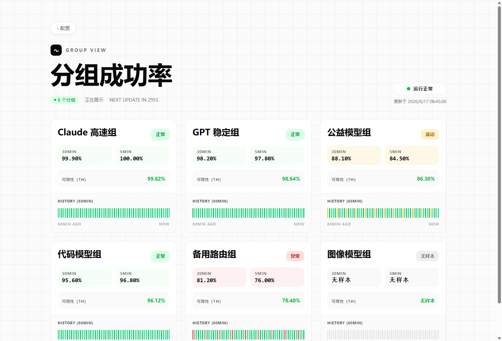
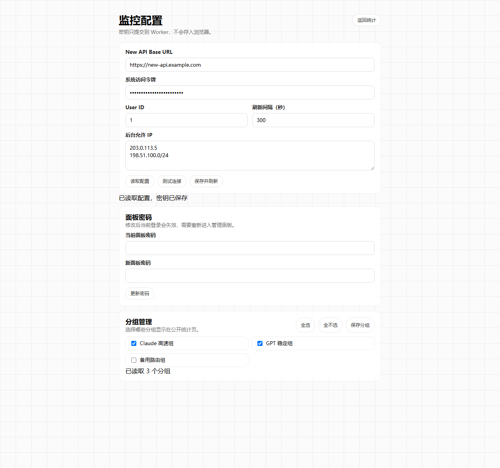

# New API Group Monitor

轻量的 New API 分组成功率监控状态页。它通过管理员提供的 New API 系统访问令牌拉取日志，在 Cloudflare Workers + D1 上聚合每个分组最近 1H / 30min / 5min 的请求成功率，并提供一个可以公开访问的状态页。

A lightweight New API group success-rate status page. It fetches New API logs with an administrator token, aggregates request availability by group, and serves a public dashboard from Cloudflare Workers + D1.



## 适合什么场景

- 想公开展示 New API 各分组可用性，但不想开放 New API 后台。
- 想用 Cloudflare 免费层部署一个轻量状态页。
- 想把系统访问令牌只保存在服务端，不进入浏览器、localStorage 或公开页面。
- 想按 New API 的 `group` 维度看最近 1 小时、30 分钟、5 分钟成功率。

## What It Does

- Shows a public status page for New API groups.
- Aggregates success rates for the last 1 hour, 30 minutes, and 5 minutes.
- Uses New API log types: `type=2` as success and `type=5` as failure.
- Stores configuration and snapshots in Cloudflare D1.
- Keeps the administrator token on the Worker side only.
- Provides an admin panel for remote New API config, refresh interval, IP allowlist, password changes, and visible group selection.



## 技术栈

- Frontend: Cloudflare Workers Static Assets
- API: Cloudflare Worker
- Database: Cloudflare D1
- Runtime: Wrangler
- Auth: HttpOnly admin session cookie, login failure rate limit, optional admin IP allowlist

## SEO Keywords

New API monitor, New API status page, New API group monitor, group success rate, API availability, Cloudflare Workers status page, Cloudflare D1 monitoring, New API 分组监控, 分组成功率, API 可用性状态页。

## 本地开发

```bash
npm install
copy .dev.vars.example .dev.vars
npm run db:init
npm run dev
```

打开：

- 统计页：<http://127.0.0.1:8813/>
- 管理登录：<http://127.0.0.1:8813/admin>

`.dev.vars` 里只放本地开发配置。真实密钥不要提交到 GitHub。

如果本地端口被占用，可以直接指定端口：

```bash
npx wrangler dev src/worker.js --local --persist-to=.wrangler/state --port 8813
```

Wrangler 本地不会自动触发 Cron；需要测试定时任务时访问：

```bash
curl http://127.0.0.1:8813/cdn-cgi/handler/scheduled
```

## Cloudflare Workers 部署

1. 创建 D1 数据库：

```bash
npx wrangler d1 create newapi-group-monitor
```

2. 把返回的 `database_id` 写入 `wrangler.toml`。

3. 初始化远程 D1：

```bash
npm run db:init:remote
```

4. 设置 Worker Secret：

```bash
npx wrangler secret put ADMIN_PASSWORD
```

5. 部署 Worker：

```bash
npm run deploy
```

## 定时刷新

Cloudflare Cron Triggers 会定时调用 `scheduled()` 刷新快照。需要开启时在 `wrangler.toml` 增加：

```toml
[triggers]
crons = ["*/5 * * * *"]
```

页面也会按配置的刷新间隔读取最新快照。缓存命中时页面会很快打开，后台刷新失败时不会把系统访问令牌返回给浏览器。

## 安全说明

- `.dev.vars`、`.wrangler/`、`node_modules/` 和日志文件不会提交。
- `wrangler.toml` 默认使用占位 D1 ID，部署时请替换为自己的数据库 ID。
- 管理员密码通过 Cloudflare Secret 注入；后台修改后的密码只保存服务端哈希。
- New API 系统访问令牌只通过配置页提交到服务端，不写入浏览器 localStorage。
- 配置接口不会把已保存的系统访问令牌返回给前端。
- 管理页设置了 `noindex,nofollow`，公开页设置了中英文 SEO 描述。

## License

MIT
